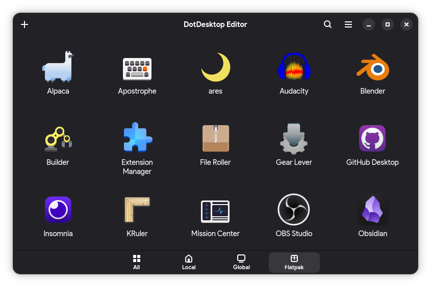

# Dotdesktop Editor
An application for browsing, creating and editing .desktop application launcher entries across your local, system, Flatpak and Snap directories.



## Download
See the **Releases** to download the latest Flatpak or AppImage.

## Development
```
npm install        # installs deps and generates TypeScript types (postinstall)
npm run dev        # run with live CSS reload
```

## Donations
If you would like to support my open source projects, feel free to [drop me a coffee (or rather, an energy drink)](https://ko-fi.com/laurasofiaheimann).

## License
This project is licensed under the [MIT License](LICENSE).

